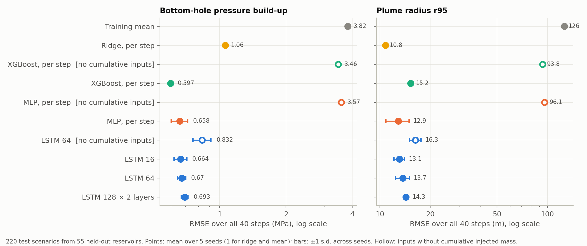
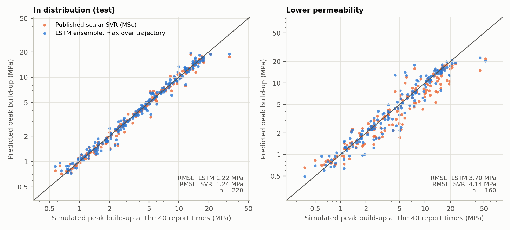
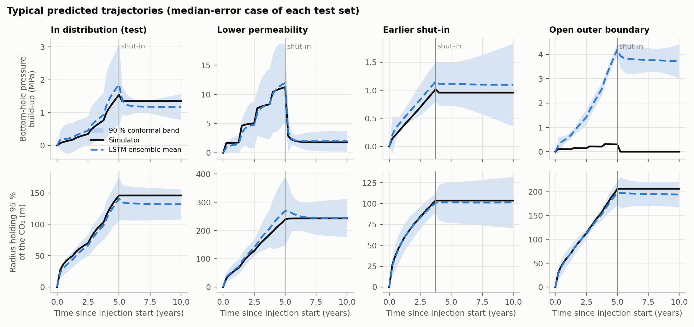
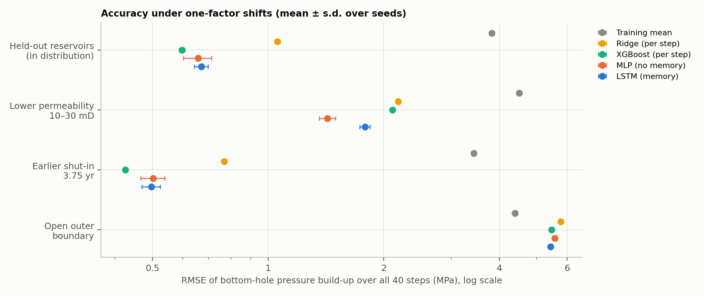
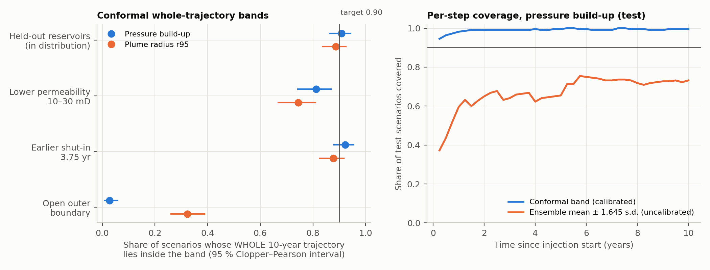

# E1 — Trajectory surrogates for CO₂ injection and shut-in (pilot)

**Status: completed pilot.** This is a bounded first experiment on synthetic
data from a simplified simulator. It is not a validation against a reference
simulator or field data; see [what the pilot does not show](#what-the-pilot-does-not-show).

## Summary

- **Question.** Can a neural network predict the whole 10-year trajectory of
  bottom-hole pressure build-up and plume radius (5 years of injection, then
  shut-in) for reservoirs it has not seen? Does a sequence model with memory
  (LSTM) earn its complexity over simpler models? Do calibrated uncertainty
  bands hold when one condition shifts?
- **Data.** The 880 simulations of the SubsurfaceML study run (220 reservoir
  realisations × 4 injection schedules), split by reservoir exactly as in the
  MSc project: 496 cases for training, 164 for calibration, and 220 test
  cases from 55 held-out reservoirs. Three shifted test sets, 600 new
  simulations with the same code, each change one factor: lower permeability,
  earlier shut-in, or an open outer boundary.
- **Models.** Training mean, ridge regression, XGBoost, a per-step MLP (no
  memory) and an LSTM (memory), 5 seeds each. Controlled comparisons: same
  inputs with and without cumulative-mass features, LSTM sizes from 2,882 to
  284,162 parameters, and a learning curve over 12–99 training reservoirs.
- **Main findings (pilot).**
  1. On held-out reservoirs the LSTM predicts pressure build-up trajectories
     with an RMSE of **0.67 ± 0.03 MPa** (mean ± s.d. over 5 seeds; training
     mean 3.82 MPa). It matches the published scalar SVR on peak pressure
     (1.22 vs 1.24 MPa, paired 95 % interval of the difference −0.12 to
     +0.17 MPa) and adds the whole trajectory.
  2. **The LSTM's memory is not needed when the inputs already carry the
     injected mass.** With the cumulative-mass inputs, a memoryless MLP is as
     accurate (difference +0.01 MPa, interval −0.06 to +0.07) and XGBoost is
     slightly better (0.60 MPa). For plume radius, ridge regression on a
     volumetric radius estimate is the most accurate model (10.8 m). Without
     those inputs, memory is decisive: LSTM 0.83 MPa against 3.5–3.6 MPa for
     the memoryless models. In that setting the LSTM learns the material
     balance from the rate history itself. Model size made no measurable
     difference (2,882 to 284,162 parameters).
  3. **Raw deep-ensemble spread is far too narrow; split-conformal
     calibration fixes it in distribution.** Whole-trajectory coverage is
     10 % for ensemble mean ± 1.645 s.d., and 91 % (95 % interval 86–94 %)
     for the conformal band, against a 90 % target.
  4. **Under shift, the calibration holds partly or fails, and the ensemble
     barely signals it.** Coverage is 92 % for earlier shut-in, 81 % for lower
     permeability and 3 % for an open boundary. An open boundary leaves every
     input unchanged, so no input-based model can detect it; the ensemble
     spread is identical to the in-distribution case.
- **Run it.** `pip install -r requirements.txt`, then `./run_all.sh` (about
  5 minutes on a 4-core CPU). Exact commands are [below](#reproduce).

## What is new, and what comes from the MSc project

| From the MSc project [SubsurfaceML](https://github.com/abdelghafarfouda/manchester-msc-projects/tree/main/advanced-subsurface-modelling/SubsurfaceML) (pinned at commit `4bccd29`) | New in E1 |
|---|---|
| The radial IMPES simulator and its 18 verification checks | Sequence datasets built from the stored time series |
| The 880-case study data and the reservoir-level split | 600 new simulations for three shifted test sets, and a re-simulation check |
| The scalar SVR and elastic-net surrogates (used here unchanged, as a reference) | Every model in this folder, the uncertainty method, the comparisons and the figures |

## Data

**In distribution.** `results/study` of SubsurfaceML (files checked against
the sha256 values in [`config.json`](config.json)). Each scenario becomes a
sequence of 40 steps of 0.25 years (t = 0.25 … 10 years).

| Partition | Reservoirs | Scenarios | Used for |
|---|---|---|---|
| fit | 99 | 396 | fitting every model |
| val | 25 | 100 | early stopping, ridge penalty |
| calib | 41 | 164 | conformal calibration only |
| test | 55 | 220 | all held-out metrics, scored once |

`fit` + `val` are the 124 training reservoirs of the MSc split; `calib` and
`test` are its calibration and test reservoirs, unchanged.

**Shifted test sets** (`data/raw/`, `scripts/generate_shift_sets.py`). Each
changes one factor:

| Set | Scenarios | What changes |
|---|---|---|
| `shift_lowk` | 160 (40 new reservoirs × 4 schedules) | median permeability 10–30 mD, below the 30–1000 mD training range; schedules drawn by the study's own procedure |
| `shift_shutin` | 220 (the test scenarios) | the fourth injection period set to zero, so injection stops at 3.75 instead of 5 years |
| `shift_openbc` | 220 (the test scenarios) | constant-pressure outer boundary instead of a sealed compartment |

The two paired sets reuse each test scenario's reservoir and schedule, so the
effect of the shift is measured scenario by scenario (the paired design of
Notebook 02 §5). Re-simulating 8 unchanged test scenarios reproduced the
stored study data to a relative difference below 7 × 10⁻⁸
(`data/raw/repro_check/provenance.json`). All 608 new simulations succeeded.

**Inputs, all known before simulating** (`e1/data.py`):

- 16 static features: the sampled reservoir description and closed-form
  summaries of it. No schedule descriptor is included, so the schedule
  enters only step by step.
- Per step: the rate during the step, time, an injecting flag and a
  steady-state flow-resistance pressure estimate.
- The `full` feature set adds three quantities that integrate the rate
  history: cumulative injected mass, a closed-compartment material-balance
  pressure `M / (ρ c_t V_p)` and a volumetric plume radius `√(M / (ρ π h φ))`.

**Targets:** bottom-hole pressure build-up Δp_bh (MPa) and r95, the radius
holding 95 % of the CO₂ mass (m), at each step. Counts and value ranges are
recorded in `data/processed/dataset_record.json`.

## Method

- **Models** (`e1/models.py`). The LSTM uses a linear input layer, one LSTM
  layer of 64 units and a two-layer output head (39,170 parameters). The MLP
  has 3 × 128 units and is applied to each step separately, with the same
  inputs and no memory (36,482 parameters). XGBoost and ridge regression treat
  each (scenario, step) as one row. Size variants: LSTM 16 (2,882 parameters)
  and LSTM 128 × 2 layers (284,162).
- **Training** (`e1/train.py`). Adam, learning rate 2 × 10⁻³ halved on
  plateau, batch 32, mean-squared error on standardised log1p targets, early
  stopping on the `val` reservoirs (patience 60), seeds 0–4. All settings are
  fixed in `config.json`; no hyperparameters were tuned on test data.
- **Uncertainty** (`e1/evaluate.py`). The five LSTM seeds form a deep
  ensemble. A split-conformal band is calibrated on the 41 calibration
  reservoirs with one score per trajectory: the largest normalised error
  over the 40 steps, max |y − μ| / (σ + floor). The band therefore covers a
  whole trajectory, not each step separately. It is reported at two units:
  per scenario (164 calibration scores), and per reservoir (41 scores, the
  maximum over a reservoir's four schedules). The reservoir-level band is the
  valid one under exchangeability of reservoirs, but it is noisier.
  Coverage carries a 95 % Clopper–Pearson interval.
- **Comparisons.** Models are compared on the same 220 test scenarios. 95 %
  intervals of RMSE differences come from a paired bootstrap that resamples
  whole reservoirs (2,000 resamples), because a reservoir's four schedules
  share its geology.

## Results

All numbers are in `results/metrics/` (`accuracy_summary.csv`,
`evaluation.json`, `learning_curve.csv`); figures are in `results/figures/`.

### Held-out reservoirs

RMSE over all 40 steps on the 220 test scenarios, mean ± s.d. over 5 seeds:

| Model | Parameters | Δp_bh (MPa) | Δp_bh, t ≤ 5 yr | Δp_bh, t > 5 yr | r95 (m) |
|---|---|---|---|---|---|
| Training mean | — | 3.82 | 3.34 | 4.24 | 126.5 |
| Ridge, per step | — | 1.06 | 1.13 | 0.98 | **10.8** |
| XGBoost, per step | — | **0.60 ± 0.01** | 0.78 ± 0.01 | **0.34 ± 0.01** | 15.2 ± 0.2 |
| MLP, per step | 36,482 | 0.66 ± 0.06 | 0.81 ± 0.09 | 0.45 ± 0.01 | 12.9 ± 2.1 |
| LSTM 16 | 2,882 | 0.66 ± 0.04 | 0.82 ± 0.04 | 0.45 ± 0.06 | 13.1 ± 1.0 |
| LSTM 64 | 39,170 | 0.67 ± 0.03 | 0.82 ± 0.04 | 0.48 ± 0.05 | 13.7 ± 1.3 |
| LSTM 128 × 2 | 284,162 | 0.69 ± 0.02 | 0.86 ± 0.03 | 0.47 ± 0.03 | 14.3 ± 0.4 |
| *without cumulative-mass inputs:* | | | | | |
| XGBoost | — | 3.46 ± 0.01 | 2.02 | 4.45 | 93.8 |
| MLP | 36,098 | 3.57 ± 0.01 | 2.21 | 4.54 | 96.1 |
| LSTM 64 | 38,978 | **0.83 ± 0.08** | 0.97 | 0.67 | **16.3** |

The average of the five LSTM seeds (the ensemble mean) reaches 0.63 MPa and
12.1 m.



Paired differences of Δp_bh RMSE on the test reservoirs (95 % interval;
**bold** = excludes zero):

| Comparison | Difference (MPa) |
|---|---|
| LSTM − MLP | +0.01 (−0.06 to +0.07) |
| LSTM − XGBoost | **+0.07 (+0.03 to +0.15)** |
| LSTM − ridge | **−0.39 (−0.62 to −0.13)** |
| LSTM 16 − LSTM 64 | −0.01 (−0.06 to +0.03) |
| LSTM 128 × 2 − LSTM 64 | +0.02 (−0.01 to +0.05) |
| LSTM − LSTM without cumulative inputs | **−0.16 (−0.21 to −0.12)** |
| LSTM − MLP, both without cumulative inputs | **−2.73 (−3.16 to −2.30)** |

**Where the error sits.** One reservoir, a 45 mD case with a simulated peak
of 32.4 MPa (`R0172`), contributes 33 % of the LSTM's squared error. It is the
same case that dominates the MSc SVR's error. Without it the LSTM's RMSE is
0.55 MPa, and the median per-scenario RMSE is 0.22 MPa. The error is largest
in the lowest-permeability third of the test reservoirs: 0.94 MPa at
30–84 mD, against 0.47 and 0.51 MPa above that.

**Learning curve** (`fig6`). Test RMSE falls from 1.16 MPa (LSTM) and
1.21 MPa (XGBoost) with 12 fitting reservoirs to 0.70 and 0.62 MPa with 50,
then only to 0.67 and 0.60 MPa with 99. The LSTM needs more data than
XGBoost to reach the same error.

### Against the published scalar surrogate

Peak Δp_bh is taken as the maximum over the 40 report times. That differs
from the simulator's own maximum in 1 of the 220 test scenarios.

| Set | LSTM ensemble, peak RMSE | MSc SVR, peak RMSE | Paired difference (95 % interval) |
|---|---|---|---|
| Test (220) | 1.22 MPa | 1.24 MPa | −0.01 (−0.12 to +0.17) |
| Lower permeability (160) | 3.70 MPa | 4.14 MPa | −0.44 (−1.24 to +0.19) |
| Earlier shut-in (220) | 0.77 MPa | 1.02 MPa | **−0.25 (−0.43 to −0.04)** |
| Open boundary (220) | 6.52 MPa | 6.43 MPa | both fail |

On the test set the SVR reproduces its published RMSE (1.2373 MPa). For the
final plume radius, the MSc elastic net remains more accurate than the LSTM
ensemble: 10.5 m against 13.3 m.



### Shifted conditions



RMSE of Δp_bh over all steps (MPa), mean over seeds:

| Set | Training mean | Ridge | XGBoost | MLP | LSTM |
|---|---|---|---|---|---|
| Test | 3.82 | 1.06 | 0.60 | 0.66 | 0.67 |
| Lower permeability | 4.51 | 2.18 | 2.11 | **1.43** | 1.79 |
| Earlier shut-in | 3.43 | 0.77 | **0.43** | 0.50 | 0.50 |
| Open boundary | **4.40** | 5.77 | 5.47 | 5.58 | 5.44 |

- **Earlier shut-in.** Paired with the same test scenarios, errors do not
  grow: the LSTM's RMSE falls from 0.67 to 0.50 MPa, partly because less CO₂
  is injected.
- **Lower permeability.** Errors grow 2.2–3.5-fold. The MLP extrapolates
  best; XGBoost, whose trees cannot extrapolate beyond their training values,
  does worse than both networks.
- **Open boundary.** Every model predicts closed-compartment pressure
  accumulation, and each is worse than predicting the training mean. The
  boundary is not an input, so this shift lies outside what any of these
  models can represent.



### Uncertainty

Whole-trajectory coverage of the 90 % conformal band (per-scenario
calibration, 164 calibration trajectories):

| Set | Δp_bh covered | r95 covered |
|---|---|---|
| Test | 200 / 220 = **0.91** (0.86–0.94) | 195 / 220 = 0.89 (0.84–0.93) |
| Earlier shut-in | 0.92 (0.88–0.95) | 0.88 (0.83–0.92) |
| Lower permeability | 0.81 (0.74–0.87) | 0.74 (0.67–0.81) |
| Open boundary | 0.03 (0.01–0.06) | 0.32 (0.26–0.39) |

- **Uncalibrated ensemble.** Mean ± 1.645 s.d. contains only 10 % of test
  pressure trajectories completely, and 67 % of individual steps (`fig4`).
  Five seeds disagree far less than the model errs.
- **Reservoir-level calibration** (41 calibration reservoirs). Test coverage
  is 0.964 (0.875–0.996) for Δp_bh and 0.800 (0.670–0.896) for r95, with wider
  bands: on average 5.8 MPa against 3.1 MPa for the per-scenario band.
- **Does the spread flag the shift?** The area under the ROC curve for
  separating shifted from test scenarios by mean ensemble spread is 0.62 for
  lower permeability (0.75 with spread relative to the prediction), 0.43 for
  earlier shut-in and exactly 0.50 for the open boundary. The open-boundary
  inputs are identical to the test inputs, so the predictions and spread are
  identical too. Detecting a wrong boundary needs observations, such as the
  gauge-based alarm of Notebook 02 §8.
- **The MSc SVR's P5–P95 band** covers the simulated peak in 88 % of test
  scenarios, 47 % under lower permeability and 1 % with an open boundary.



### Cost

Training one LSTM seed takes 8.5 s with one CPU thread. Inference takes about
0.17 ms per scenario in a batch. One simulation takes a median of 0.52 s
(mean 1.8 s) with one process. These figures exclude generating the training
data: the 880 study simulations took about 2,900 CPU-seconds in the MSc run.

## What the pilot shows

- A sequence model trained on 99 reservoirs predicts whole injection and
  shut-in trajectories for unseen reservoirs as accurately at the peak as the
  published scalar surrogate.
- Model complexity was judged by measurement and is not justified here.
  Memory helps only when the cumulative injected mass is withheld from the
  inputs; with physics-based cumulative features, a per-step MLP or XGBoost
  is as good or better, and LSTM size does not matter.
- Conformal calibration over whole trajectories gives the stated coverage in
  distribution and under an operating change. It degrades under a geology
  shift and collapses under an unrepresented physics change. Ensemble spread
  does not detect either.

## What the pilot does not show

- **Physics.** The simulator is radial and isothermal, with a sealed
  compartment in the training data and no gravity, capillary pressure,
  dissolution or vertical crossflow. Post-shut-in pressure is therefore
  nearly flat, and the results say nothing about plume migration under
  buoyancy.
- **Reference.** There is no comparison with OPM Flow, MRST or field data.
- **Scale.** One split (the published one), 99 fitting reservoirs and
  5 seeds. Repeated splits and larger ensembles are needed before any
  general claim.
- **Tuning.** Configurations were fixed in advance, not tuned at a matched
  budget. A tuned model could change the ranking.
- **Exchangeability.** The per-scenario conformal band treats the four
  schedules of a reservoir as exchangeable, which they are not. The
  reservoir-level band avoids this, at the cost of a noisier quantile.
- **Spatial output.** Fields (saturation and pressure maps) are not
  predicted; the stored data contain only time series.

Next steps, in order:

1. Repeat over several reservoir splits.
2. Add the boundary type and gauge observations as inputs, to test detection
   of a wrong boundary.
3. Re-simulate fields and train the ConvLSTM / U-Net of Notebook 03 on them.
4. Repeat on a reference simulator with gravity.

## Reproduce

From this folder, with Python 3.11:

```bash
python -m venv .venv && source .venv/bin/activate     # Windows: .venv\Scripts\activate
pip install -r requirements.txt
python scripts/run_training.py     # 72 runs, ~3 min on 4 cores -> results/checkpoints, logs, predictions
python scripts/evaluate.py         # ~1 min -> results/metrics
python scripts/make_figures.py     # -> results/figures
python -m pytest tests -q          # 11 tests
```

The processed datasets are in `data/processed/`, so no simulator is needed
for the steps above. To regenerate the shifted simulations, the dataset files
and the SVR reference from source, check out
[manchester-msc-projects](https://github.com/abdelghafarfouda/manchester-msc-projects)
at commit `4bccd29` (or later, with the same `SubsurfaceML/src` tree). Install
SubsurfaceML from that checkout (see `requirements.txt`), then run
`REGENERATE_DATA=1 MSC=/path/to/manchester-msc-projects ./run_all.sh`. That
takes about 5 more minutes; the scripts refuse to run if the pinned files or
the source tree differ.

**Recorded environment** (`results/environment.txt`): Python 3.11.15, NumPy
2.4.4, SciPy 1.17.1, pandas 3.0.2, scikit-learn 1.8.0, XGBoost 3.2.0, PyTorch
2.14.0 (CPU), on a 4-core Linux x86-64 machine. Seeds are fixed. Retraining
the five LSTM seeds from scratch on the same machine reproduced the saved
predictions bit for bit (largest difference 0.0). A different CPU or library
build can change the last digits of the metrics.

## Files

```
config.json                 every setting: data pins, shifted sets, models, training, uncertainty
e1/data.py                  sequence building, features, scaler, partitions
e1/models.py                LSTM and per-step MLP
e1/train.py                 training of every model; checkpoints, logs, predictions
e1/evaluate.py              metrics, paired bootstrap, conformal bands, Clopper-Pearson, AUROC
scripts/                    generate_shift_sets, build_dataset, scalar_reference, run_training, evaluate, make_figures
data/raw/                   the new simulations (scenarios, time series, provenance with sha256)
data/processed/             sequence datasets (.npz), dataset record, SVR reference predictions
results/checkpoints/        network weights + fitted scalers, one file per model and seed
results/logs/               per-epoch losses of every network run; console logs
results/predictions/        predictions of every run on every set
results/metrics/            accuracy tables, evaluation.json, learning curve
results/figures/            fig1-fig6
tests/test_e1.py            11 tests
```

## Credits and contribution

- **Simulator, data and scalar surrogates.** SubsurfaceML, the author's MSc
  project (MIT licence), as pinned above. The course materials it follows
  are credited in that project's README and source map.
- **Methods.**
  - LSTM: Hochreiter & Schmidhuber (1997), *Neural Computation* 9(8).
  - Deep ensembles: Lakshminarayanan, Pritzel & Blundell (2017), *NeurIPS* 30.
  - Split-conformal prediction: Lei, G'Sell, Rinaldo, Tibshirani & Wasserman
    (2018), *JASA* 113(523).
  - Conformal bands for functional data: Lei, Rinaldo & Wasserman (2015),
    *Ann. Math. Artif. Intell.* 74(1).
  - Clopper & Pearson (1934), *Biometrika* 26(4).
  - XGBoost: Chen & Guestrin (2016), *KDD*.
- **Software.** PyTorch, scikit-learn, XGBoost, NumPy, SciPy, pandas and
  Matplotlib, under their own licences.
- **Contribution.** This experiment is new work, added after the MSc. Its
  code, runs and write-up were produced with an AI coding assistant (Claude
  Code) at the author's request. It builds on the author's SubsurfaceML
  simulator and data, and on the research question of this repository.
